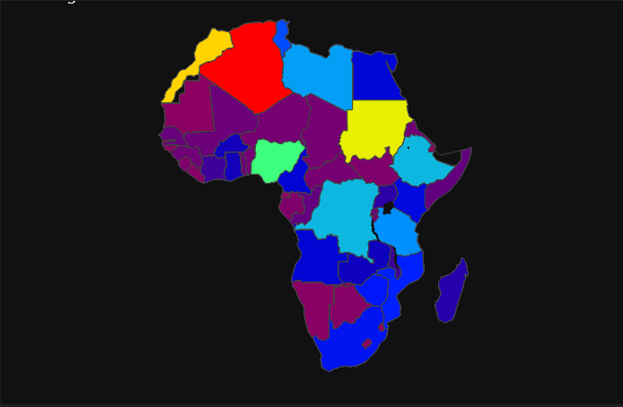

## SUMMARY
## [View Notebook](https://nbviewer.org/github/TelRich/Africa_Health_Analysis-10Alytics_Hackathon_2022/blob/main/health.ipynb?flush_cache=True)

1. In Africa, average of _134_ people die as a result of _terrorism_,  average of _46_ people die as a result of _drug use disorder_ while average of _379_ people die as a result of _poisoming_.

2. Below are the top 5 country for each cause of death analyzed above:

|     | Terrorism | Drug Use Disorder | Poisoning |
| --- | --- | --- | --- |
| 1 | Nigeria [22,674] | Algeria [10,612] | Nigeria [107,604] |
| 2 | Algeria [11,066] | Morocco [7,718] | Ethiopia [101,065] |
| 3 | Somalia [102,42] | South AFrica [7,414] | Congo Republic [37,676] |
| 4 | Burundi [4,205] | Sudan [6,526] | Tanzania [27,430] |
| 5 | Congo Republic [4,069] | Nigeria [4,897] | Suda [25,388] |

3. Based on the given data, there has been no death by terrorism in year 2018 and 2019.
4. In year 2015 Sierra Leone spent 20.4% of their GDP on health services
5. In Nigeria, there is a huge number of death with children under age 5

LIMITATION:
* The type of drugs that cause death is not available. We could have narrow it down to who's producing such drugs and in what location is it killing the most.
* Types of poison causing death is not available. We could narrow it down to know if it's from companies or individuals.
* Data about each country GDP was not used. This could help narrow down why some countries refused to invest more in health expenditure. 

